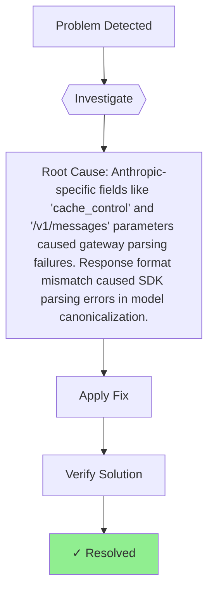

# Claude Code CLI cannot talk to SCNet gateway with 422/401 errors - Task Summary

## 快照
Claude Code CLI cannot talk to SCNet gateway with 422/401 errors → Anthropic-specific fields like 'cache_control' and '/v1/messages' parameters caused gateway parsing failures. Response format mismatch caused SDK parsing errors in model canonicalization. → See solution doc for fix steps → ✓ Resolved

## 诊断流程



## 关键信息

| 项目 | 内容 |
|------|------|
| **模块** | api-client |
| **严重性** | high |
| **根本原因** | Anthropic-specific fields like 'cache_control' and '/v1/messages' parameters caused gateway parsing failures. Response format mismatch caused SDK parsing errors in model canonicalization. |
| **解决方案** | See solution doc for fix steps |
| **标签** | `bridge`, `openai`, `protocol-mapping`, `crash-fix`, `headless` |

## 快速参考

**一键修复**:
```bash
See solution doc for fix steps
```

## 参考链接

- [完整 Solution Doc](g:\Workspace\claude-code\docs\solutions\claude-bridge-scnet-fix.md)

---

✨ **Generated by**: Compound Engineering + Antigravity Integration  
📅 **Date**: 2026-04-01  
🏷️ **Tags**: bridge, openai, protocol-mapping, crash-fix, headless
